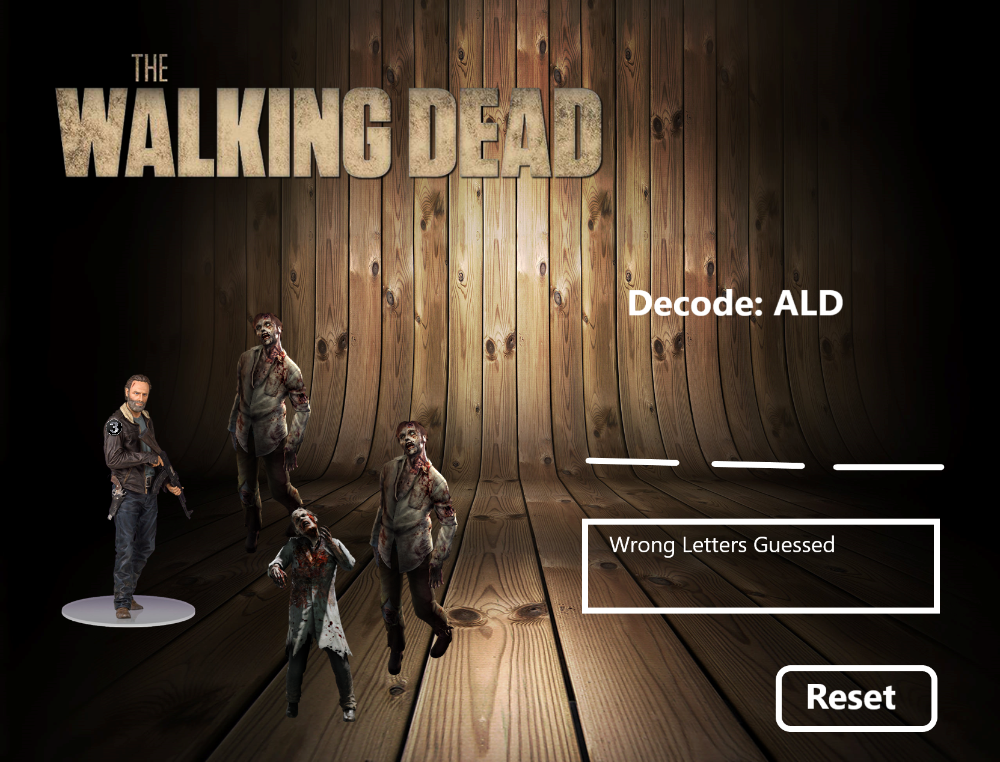
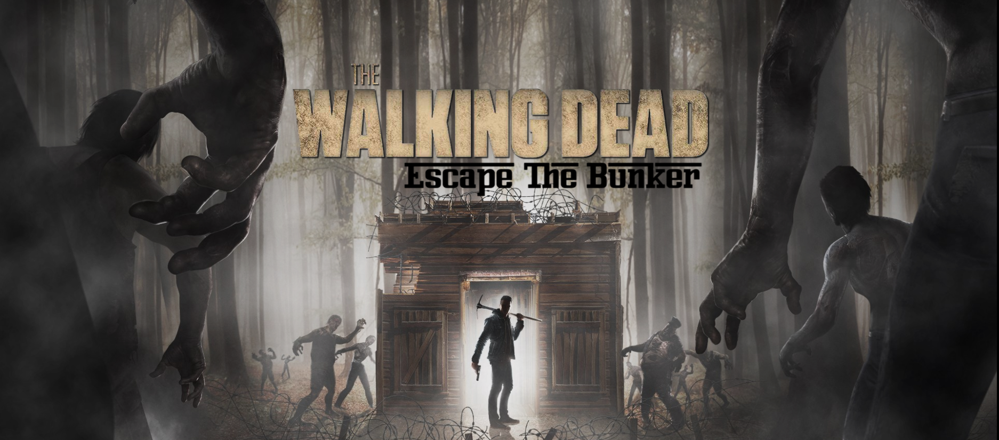
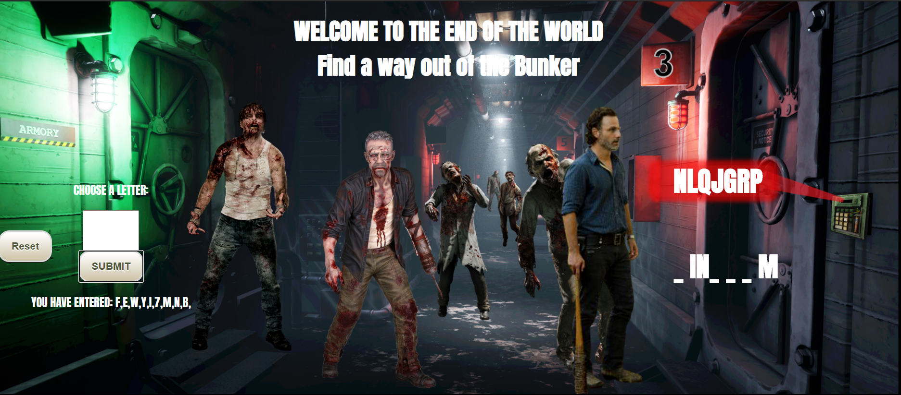

# TWD-Escape_the_Bunker
This game is based off the famous tv show `The Walking Dead` and incorporates a hangman style game with a decoding twist to it. I am testing out how to apply JS, HTML and CSS to create a fully functioning game.

Created by Edrees H.

## Table of Contents

* [About the Project](#about-the-project)
  * [Built With](#built-with)
* [Getting Started](#getting-started)
    * [Prerequisites](#prerequisites)
    * [Installation](#installation)
* [Preview](#preview)
* [Roadmap](#my-roadmap)
    * [HTML](#HTML)
    * [CSS](#CSS)
    * [JavaScript](#Javascript)
* [Contact](#contact)


## About The Project
I built this game based off of the award winning hit series "The Walking Dead," on amc. The concept of the game goes as follows...
    It is the year 2025 and you come across a bunker filled with food and supplies. Excited, you rush into the bunker unaware of the boobie trapped door slamming shut behind you. The only way to escape from the bunker is to enter the encoded word to open the bunker doors. You have no ammo and the door is rigged so that if you get a letter wrong, a zombie gets released into the bunker. There is no room for mistakes!

MY plan was to first build a game of hangman but after completing that task within a few days, I wanted to make the game much more interesting so I introduced encoded words into the game. The encoding I used is a Caesar cypher. 

### Built With

* HTML
* CSS
* VANILLA JAVASCRIPT


## Getting Started

        To get a local copy up and running follow these simple steps.

### Prerequisites

        * Have a program to open files, `VSCODE` is recommended.


### Installation

1. Go to https://github.com/edgerees/TWD-Escape_the_Bunker and `Fork` the repo <br>
2. git clone https://github.com/edgerees/TWD-Escape_the_Bunker.git<br>
3. Open terminal and open folder location, then open in `VSCODE`
```git 
 /TWD-Escate_the_Bunker code .
```
## Preview
1. My first draft was fairly simple and dry, but it helped me come up with an outline for the project
 

2. Final Results of Project



## My Roadmap
I have included a walkthrough of my code in order to better understand it.
### CSS
1. Used Grid and Flex to position items
```css
{   display: none;
    grid-template-columns: 1fr 2fr 1fr;
    align-items: center;
    justify-content: center;
  }
```

2. Set up 5 pages to navigate through the game smoothly.
```CSS
#page1 {
    display: flex;
    flex-direction: column;
    align-items: center;
    justify-content: center;
  }

#page2 {
    display: none;
    grid-template-columns: 1fr 2fr 1fr;
    align-items: center;
    justify-content: center;
  }

#page3 {
    display: none;
    grid-template-columns: 1fr 2fr 1fr;
    align-items: center;
    justify-content: center;
  }

#page4 {
    display: none;
    grid-template-columns: 1fr 2fr 1fr;
    align-items: center;
    justify-content: center;
  }

#page5 {
    display: none;
    grid-template-columns: 1fr 2fr 1fr;
    align-items: center;
    justify-content: center;
  }

```

3. Fog animations
```CSS
.bunker {
    position: absolute;
    top: 0;
    left: 0;
    height: 100%;
    width: 100%;
    z-index: 0;
    background: url("final1.jfif");
    background-position: 25%;
    background-repeat: no-repeat;
    background-size: cover;
    overflow: hidden;
}


.fog {
    position: relative;
    height: 100vh;
    width: 100%;
    background: #fff;
  }

.fog-container {
    position: absolute;
    width: 100%;
    height: 100%;
    overflow: hidden;
    z-index: 1;
  }

.fog-img {
    position: absolute;
    height: 100vh;
    width: 300vw;
    z-index: 2;
  }

.fog-img-first {
    background: url("fog1.png");
    background-repeat: repeat-x;
    background-size: contain;
    background-position: center;
    animation: marquee 60s linear infinite;
  }

.fog-img-second {
    background: url("fog2.png");
    background-repeat: repeat-x;
    background-size: contain;
    background-position: center;
    animation: marquee 30s linear infinite;
  }

@keyframes marquee {
    0% {
      transform: translate3d(0, 0, 0);
    }

    100% {
      transform: translate3d(-200vw, 0, 0);
    }
  }
```
### Javascript

1. DOMcontentLoaded, Navigate through pages + Play Music.
```js
    let youDoWantTo = document.querySelector('#yes')
    youDoWantTo.addEventListener('click', () => {

          document.getElementById('themesong').play()
          document.getElementById('page1').style.display = 'none'
          document.getElementById('page2').style.display = 'grid'
    })

    let youDoNotWantTo = document.querySelector('#no')
    youDoNotWantTo.addEventListener('click', () => {
          window.location.href= 'https://www.amc.com/shows/the-walking-dead--119'
    })

    let turnToPage3 = document.getElementById('introtalk1')
    turnToPage3.addEventListener('click', () => {

          document.getElementById('page2').style.display = 'none'
          document.getElementById('page3').style.display = 'grid'
    })

    let turnToPage4 = document.getElementById('introtalk2')
    turnToPage4.addEventListener('click', () => {

          document.getElementById('page3').style.display = 'none'
          document.getElementById('page4').style.display = 'grid'
    })

    let turnToPage5 = document.getElementById('introtalk3')
    turnToPage5.addEventListener('click', () => {

          document.getElementById('page4').style.display = 'none'
          document.getElementById('page5').style.display = 'grid'
    })
```
1. Arrays:
```js

    let arr = ['rick', 'carl', 'walkers', 'shane', 'cdc', 'biters', 'daryl', 'governor', 'merle', 'michonne', 'glenn', 'prison', 'alexandria', 'alpha', 'negan', 'kingdom', 'woodbury', 'sanctuary' ];

    let threeLettersBack ='DEFGHIJKLMNOPQRSTUVWXYZABC';
    /*Caesar Cypher Array*/

    let decodedAlpha = 'ABCDEFGHIJKLMNOPQRSTUVWXYZ';
    /*Caesar Cypher Array*/
    let randomWord = arr[Math.floor(Math.random() * arr.length)];
    /* Choose a random word in the arr array, Math floor to return array integers  */
    let splitRandomWord = randomWord.split('');
    /* Splits the random word to return each letter*/

    let dashHolder = [];
    /*Holds the dash so I can push letters to it*/
```
2. Setting up Caesar Cypher (After pulling random word, running it through CaesarCypher)
```js
    let caesarHolder =''

    for (let i = 0; i < splitRandomWord.length; i++) {
          for (let j = 0; j < decodedAlpha.length; j++) {
                if (splitRandomWord[i].toUpperCase()=== decodedAlpha[j]) {
                      caesarHolder += threeLettersBack[j]
                } /*concatanate*/
```
3. Letter Catcher + inerHTML (outside of click events)
```js
let letterCatcher = []; /*Keep track of what user enters*/
    console.log(letterCatcher)

    document.getElementById('encoded-word').innerHTML = caesarHolder;
    document.getElementById('dash-holder').innerHTML = dashHolder.join('');
    document.getElementById('correct-answer').innerHTML = `THE CORRECT ANSWER WAS: ${randomWord.toUpperCase()}`

    let wrongAnswers = 0
    /*Wrong answer counter set outside of the eventlisteners*/
```

4. Event Listeners: No-input, same letter, start game

```js

let form = document.querySelector('#form4');

    form.addEventListener('submit', (event) => /*Listen to whats been submitted*/ {
          event.preventDefault(); /*Prevent refresh*/
          let temp = dashHolder.join(''); /* Gauge wrong answers*/
          let userInput = (document.querySelector('#user-input').value).toLowerCase()
          if (userInput === '') /*Did user put anything in*/{
                window.alert('YOU MUST ENTER A LETTER!');
          }else if (letterCatcher.includes(userInput.toUpperCase())) {
                window.alert('THATS THE SAME LETTER!');
                document.getElementById('user-input').value = '' 
                }else {
```
5. Event Listeners: RIGHT ANSWER
```js
         
/*If its the right answer= Push to dash-holder and view to user*/
                for (let i = 0; i < splitRandomWord.length; i++) {
                      if (userInput === splitRandomWord[i]) {
                            dashHolder[i] = `${userInput}`;
                            document.getElementById('dash-holder').innerHTML = (dashHolder.join('')).toUpperCase()
                      }
                } 

```
5. Event Listeners: WRONG ANSWER
```js
/*If letter is not correct- there is still a dash showing, function will push to wrongAnswers which is currently at 0 then begin line 275 function*/
                if (temp == dashHolder.join('')) {
                      wrongAnswers++;
                }
                letterCatcher.push(userInput.toUpperCase())
                document.getElementById('playerchoice').innerHTML = `YOU HAVE ENTERED: ${letterCatcher}, `
                if (wrongAnswers === 1) { 
                      document.getElementById("background5").style.backgroundImage = "url('bgg2.png')";
                }else if (wrongAnswers === 2) {
                      document.getElementById("background5").style.backgroundImage = "url('bgg3.png')";
                }else if (wrongAnswers === 3) {
                      document.getElementById("background5").style.backgroundImage = "url('bgg4.png')";
                }else if (wrongAnswers === 4) {
                      document.getElementById("background5").style.backgroundImage = "url('bgg5.png')";
                }else if (wrongAnswers === 5) {
                      document.getElementById("background5").style.backgroundImage = "url('bgg6.png')";
                }else if (wrongAnswers === 6) {
                      document.getElementById("background5").style.backgroundImage = "url('bgg7.png')";
                }
```
5. Event Listeners: WRONG ANSWER
```js
                if (!dashHolder.includes('_ ')){
                      document.getElementById('page5').style.display = "none";
                      document.getElementById('you-win').style.display = "flex";
                } else if (wrongAnswers === 7) {
                      document.getElementById('page5').style.display = 'none'
                      document.getElementById('you-lose').style.display = "flex"
                }
          }
          document.getElementById('user-input').value = ''

    })
```


## Contact

Feel free to check out the rest of my work at [GitHub](https://github.com/edgerees/TWD-Escape_the_Bunker) <br>

Email: [Gmail](www.gmail.com): edreeshuss@gmail.com


